# AI News Parser Clean - Architecture Overview

## System Design

The AI News Parser Clean is built with a modular, five-phase architecture that separates concerns and ensures reliability. The system processes AI news from RSS feeds through content extraction, media processing, WordPress preparation, and final publishing.

## Core Components

### 1. Core Module (`core/`)
The heart of the application containing:

- **main.py**: Command-line interface and orchestration
- **config.py**: Configuration management
- **database.py**: SQLite database operations
- **models.py**: Pydantic models for data validation

### 2. Services Module (`services/`)
Specialized services for each processing phase:

- **rss_discovery.py**: RSS feed scanning and article discovery
- **content_parser.py**: Firecrawl Extract API integration
- **media_processor.py**: Media download and processing
- **firecrawl_client.py**: Centralized Firecrawl API client
- **wordpress_publisher.py**: WordPress content preparation and translation

### 3. Monitoring Module (`monitoring/`)
Real-time system monitoring:

- **app.py**: FastAPI application with WebSocket support
- **api.py**: REST API endpoints
- **database.py**: Metrics storage
- **collectors.py**: System and application metrics collection

## Processing Pipeline

```mermaid
graph LR
    A[RSS Feeds] --> B[Phase 1: RSS Discovery]
    B --> C[Pending Articles]
    C --> D[Phase 2: Content Parsing]
    D --> E[Completed Articles]
    E --> F[Phase 3: Media Processing]
    F --> G[Articles with Media]
    G --> H[Phase 4: WordPress Preparation]
    H --> I[Translated Articles]
    I --> J[Phase 5: WordPress Publishing]
    J --> K[Published to WP]
```



### [Phase 1: RSS Discovery](phases/phase1_rss_discovery.md)
1. Scan 26 configured RSS feeds
2. Extract article metadata
3. Check for duplicates
4. Save as 'pending' status

### [Phase 2: Content Parsing](phases/phase2_content_parsing.md)
1. Fetch pending articles
2. Call Firecrawl Extract API
3. Extract full content, summary, tags
4. Update to 'parsed' status

### [Phase 3: Media Processing](phases/phase3_media_processing.md)
1. Parse articles for media URLs
2. Download images/videos with wget
3. Validate dimensions (≥300×300px) and size (3KB-2MB)
4. Store with metadata (width, height)

### [Phase 4: WordPress Preparation](phases/phase4_wordpress_preparation.md)
1. Load articles with status 'completed'
2. Translate content using DeepSeek Chat API
3. Generate SEO metadata (Yoast compatible)
4. Categorize (max 1) and tag articles (max 5 tags)
5. Save to wordpress_articles table

### [Phase 5: WordPress Publishing](phases/phase5_wordpress_publishing.md)
1. Create WordPress posts via REST API (draft status)
2. Upload media with translated alt_text only (no caption/description)
3. Set featured images
4. Insert remaining images into content
5. Update publication status

## Database Schema

### Sources Table
```sql
CREATE TABLE sources (
    id INTEGER PRIMARY KEY,
    name TEXT NOT NULL,
    url TEXT NOT NULL,
    rss_url TEXT NOT NULL,
    category TEXT,
    is_active BOOLEAN DEFAULT 1,
    -- Extract API specific fields
    extract_rules TEXT,
    extract_wait_for TEXT
);
```

### Articles Table
```sql
CREATE TABLE articles (
    id INTEGER PRIMARY KEY,
    source_id INTEGER,
    url TEXT UNIQUE NOT NULL,
    title TEXT NOT NULL,
    content TEXT,
    published_date DATETIME,
    content_status TEXT DEFAULT 'pending',  -- pending, parsed, completed, failed, published
    -- Extract API fields
    extract_success BOOLEAN,
    extract_markdown TEXT,
    summary TEXT,
    tags TEXT,
    categories TEXT,
    media_count INTEGER DEFAULT 0
);
```

### Media Files Table
```sql
CREATE TABLE media_files (
    id INTEGER PRIMARY KEY,
    article_id INTEGER,
    url TEXT NOT NULL,
    type TEXT,
    local_path TEXT,
    file_size INTEGER,
    width INTEGER,
    height INTEGER,
    status TEXT DEFAULT 'pending'
);
```

### WordPress Articles Table
```sql
CREATE TABLE wordpress_articles (
    id INTEGER PRIMARY KEY,
    article_id TEXT NOT NULL UNIQUE,
    title TEXT NOT NULL,
    content TEXT NOT NULL,
    excerpt TEXT,
    slug TEXT NOT NULL,
    categories TEXT,  -- JSON array
    tags TEXT,        -- JSON array
    _yoast_wpseo_title TEXT,
    _yoast_wpseo_metadesc TEXT,
    focus_keyword TEXT,
    featured_image_index INTEGER DEFAULT 0,
    images_data TEXT DEFAULT '{}', -- No images used
    translation_status TEXT DEFAULT 'pending',
    translation_error TEXT,  -- Error message if failed
    translated_at DATETIME,
    published_to_wp BOOLEAN DEFAULT 0,
    wp_post_id INTEGER,
    source_language TEXT,
    target_language TEXT DEFAULT 'ru',
    llm_model TEXT,
    created_at DATETIME DEFAULT CURRENT_TIMESTAMP
);
```

## Key Design Decisions

### 1. Five-Phase Architecture
- **Separation of Concerns**: Each phase has a single responsibility
- **Fault Tolerance**: Failures in one phase don't affect others
- **Scalability**: Phases can be run independently
- **WordPress Integration**: Dedicated phase for content preparation

### 2. Extract API Focus
- **Simplicity**: Single API for all content extraction
- **Reliability**: Better success rates than scraping
- **Maintenance**: Less code to maintain

### 3. Async Processing
- **Performance**: Non-blocking I/O for API calls
- **Concurrency**: Process multiple articles simultaneously
- **Rate Limiting**: Built-in protection against API limits

### 4. Smart Media Handling (Phase 3 only)
- **Deduplication**: Reduce storage by 40%
- **Filtering**: Remove logos and irrelevant images
- **Metadata**: Store dimensions and file info
- **Note**: Phase 4 WordPress publishing does not use images

## Configuration

### Environment Variables
```bash
FIRECRAWL_API_KEY      # Firecrawl API authentication
OPENAI_API_KEY         # DeepSeek API key for WordPress publishing
WORDPRESS_LLM_MODEL    # DeepSeek model (deepseek-reasoner or deepseek-chat)
DATABASE_PATH          # SQLite database location
LOG_LEVEL             # Logging verbosity
MEDIA_BASE_PATH       # Media storage directory
```

### Source Configuration
Sources are configured in `services/sources_extract.json`:
```json
{
  "name": "TechCrunch AI",
  "url": "https://techcrunch.com",
  "rss_url": "https://techcrunch.com/category/ai/feed/",
  "category": "news",
  "extract_rules": {
    "wait_for": ".article-content"
  }
}
```

## Error Handling

### Retry Strategy
- 3 retries with exponential backoff for API calls
- Permanent failure detection
- Circuit breaker for problematic sources
- WordPress phase: 3-minute timeout per article
- Failed translations saved with error status

### Logging
- Structured logging with context
- Separate log files per module
- Log rotation and archival

## Performance Considerations

### Database Optimization
- Indexes on frequently queried fields
- Batch operations for bulk updates
- Connection pooling

### API Rate Limiting
- Configurable rate limits
- Queue-based processing
- Graceful degradation

### Memory Management
- Streaming for large files
- Garbage collection hints
- Resource cleanup

## Security

### API Keys
- Environment variable storage
- No hardcoded credentials
- Secure configuration loading

### Database
- Parameterized queries
- Input validation
- Access control

## Monitoring

### Metrics Collected
- Articles processed per hour
- API success/failure rates
- System resource usage
- Media download statistics


## Future Extensibility

The architecture supports:
- Additional content sources
- New processing phases
- Alternative storage backends
- API exposure for external access

## Known Issues and Solutions

### Critical Database Issues

#### 1. Duplicate Database Problem
The monitoring system created a duplicate database at `monitoring/data/ainews.db` instead of using the main database at `data/ainews.db`. This caused:
- Dashboard changes not reflecting in the main system
- PUT requests to `/api/extract/config` saving to wrong database
- Inconsistent `global_last_parsed` values

**Solution**: Fixed by updating `monitoring/extract_api.py` to use absolute paths to the main database.

#### 2. Orphaned Media Files
The system doesn't automatically delete media files when articles are removed:
- 255 orphaned media files found (73% of total)
- Database integrity issues
- Wasted storage space

**Solution**: Implement periodic cleanup of orphaned media records.

#### 3. Empty Error Logs
The `error_logs` table exists but contains 0 records, indicating error logging is not implemented.

**Solution**: Implement `monitoring_integration.on_error()` calls in all error handlers.

### System Architecture Issues

#### 1. Global Last Parsed Synchronization
Implemented a global synchronization system using the `global_config` table to ensure all RSS sources use the same `last_parsed` timestamp. This prevents sources from parsing different time periods.


#### 3. Missing JavaScript Functions
The dashboard is missing 4 JavaScript functions for:
- Error display formatting
- Real-time metric updates
- Source health visualization

### Logging Issues

#### 1. Duplicate Timestamps
Logs showed multiple timestamps like `[14:17:59] [14:17:59] [14:17:59]` due to time being added at multiple layers.

**Solution**: Standardized logging format to add timestamp only once.

#### 2. JSON Logging Not Implemented
System uses text logging instead of structured JSON logging, making log parsing difficult.

### API Security

The monitoring API lacks authentication, allowing unrestricted access to system data and controls.

## Updated Database Paths

**Main Database**: `/Users/skynet/Desktop/AI DEV/ainews-clean/data/ainews.db`
- Articles, sources, media files, WordPress content
- Global configuration including `global_last_parsed`

**Monitoring Database**: `/Users/skynet/Desktop/AI DEV/ainews-clean/data/monitoring.db`
- System metrics, source health
- Parse history, error logs (currently empty)
- API metrics

## Documentation

For detailed information, see:
- [Database Schema](DATABASE_SCHEMA.md) - Complete database structure
- [API Reference](API_REFERENCE.md) - All API endpoints
- [Troubleshooting Guide](TROUBLESHOOTING.md) - Common issues and solutions