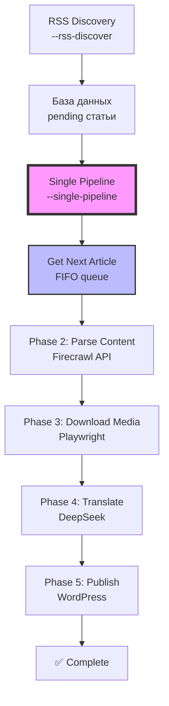

# Architecture - Single Pipeline System + External Prompts

**Обновлено**: 9 августа 2025 - Session Management Fixes + Stable Parallel Processing

## System Design

AI News Parser использует архитектуру единого пайплайна (Single Pipeline), где каждая статья обрабатывается индивидуально через все фазы от начала до конца. Ключевой принцип: **1 запуск = 1 статья**.

## Core Components

### 1. Core Module (`core/`)
Основные компоненты системы:

- **main.py**: Упрощенная точка входа (только --rss-discover, --single-pipeline, --stats)
- **single_pipeline.py**: Главная логика единого пайплайна
- **config.py**: Управление конфигурацией
- **database.py**: Операции с SQLite
- **models.py**: Pydantic модели для валидации

### 2. Services Module (`services/`)
Specialized services for each processing phase:

- **rss_discovery.py**: RSS feed scanning and article discovery
- **content_parser.py**: Firecrawl Scrape API + DeepSeek AI content cleaning (6 min timeout, no retries)
- **media_processor.py**: Media download and processing with Playwright
- **firecrawl_client.py**: Centralized Firecrawl API client
- **wordpress_publisher.py**: WordPress content preparation and translation (DeepSeek)
- **change_monitor.py**: Change tracking for articles using Firecrawl
- **prompts_loader.py**: 🆕 External prompts loading system with variable substitution

### 3. Monitoring Module (`monitoring/`)
Real-time system monitoring:

- **app.py**: FastAPI application with WebSocket support
- **api.py**: REST API endpoints
- **database.py**: Metrics storage
- **collectors.py**: System and application metrics collection

## Single Pipeline Flow



### [Phase 1: RSS Discovery](phases/phase1_rss_discovery.md)
1. Scan 26 configured RSS feeds
2. Extract article metadata
3. Check for duplicates
4. Save as 'pending' status

### [Phase 2: Content Parsing](phases/phase2_content_parsing.md)
1. Fetch pending articles
2. Call Firecrawl Scrape API for raw markdown
3. Clean content with DeepSeek AI using external prompt (`prompts/content_cleaner.txt`)
4. Extract real image URLs and add [IMAGE_N] placeholders
5. Update to 'parsed' status with cleaned content

### [Phase 3: Media Processing](phases/phase3_media_processing.md)
1. Parse articles for media URLs
2. Download images/videos with wget
3. Validate dimensions (≥300×300px) and size (3KB-2MB)
4. Store with metadata (width, height)

### [Phase 4: WordPress Preparation](phases/phase4_wordpress_preparation.md)
1. Load articles with status 'completed'
2. Translate content using DeepSeek Reasoner with external prompt (`prompts/article_translator.txt`)
3. Generate tags using DeepSeek Chat with external prompt (`prompts/tag_generator.txt`)
4. Generate SEO metadata (Yoast compatible)
5. Categorize (max 1) and tag articles (2-5 tags from 74 curated)
6. Save to wordpress_articles table

### [Phase 5: WordPress Publishing](phases/phase5_wordpress_publishing.md)
1. Create WordPress posts via REST API (draft status)
2. Upload media with alt_text translated using GPT-3.5 and external prompt (`prompts/image_metadata.txt`)
3. Set featured images
4. Insert remaining images into content with [IMAGE_N] placeholder replacement
5. Update publication status

## Database Schema

### Sources Table
```sql
CREATE TABLE sources (
    id INTEGER PRIMARY KEY,
    name TEXT NOT NULL,
    url TEXT NOT NULL,
    rss_url TEXT NOT NULL,
    category TEXT,
    is_active BOOLEAN DEFAULT 1,
    -- Extract API specific fields
    extract_rules TEXT,
    extract_wait_for TEXT
);
```

### Articles Table
**⚠️ ОЧИЩЕНО (7 августа 2025)**: Удалены неиспользуемые поля Extract API

```sql
CREATE TABLE articles (
    article_id TEXT PRIMARY KEY,          -- SHA256 хеш от URL
    source_id TEXT NOT NULL,              -- FK к sources.source_id
    url TEXT NOT NULL UNIQUE,             -- URL статьи
    title TEXT,                           -- Заголовок статьи
    content TEXT,                         -- Полный текст (очищенный DeepSeek)
    published_date DATETIME,              -- Дата публикации
    created_at DATETIME DEFAULT CURRENT_TIMESTAMP,
    content_status TEXT DEFAULT 'pending', -- pending/parsed/failed/published
    content_error TEXT,                   -- Сообщение об ошибке
    parsed_at DATETIME,                   -- Время успешного парсинга
    media_count INTEGER DEFAULT 0,        -- Количество медиафайлов
    media_status TEXT DEFAULT 'pending'   -- pending/ready/processing
    
    -- УДАЛЕНО: Поля Extract API
    -- tags TEXT, word_count INTEGER, reading_time_minutes INTEGER,
    -- summary TEXT, categories TEXT, language TEXT
);
```

### Media Files Table
```sql
CREATE TABLE media_files (
    id INTEGER PRIMARY KEY,
    article_id INTEGER,
    url TEXT NOT NULL,
    type TEXT,
    local_path TEXT,
    file_size INTEGER,
    width INTEGER,
    height INTEGER,
    status TEXT DEFAULT 'pending'
);
```

### WordPress Articles Table
```sql
CREATE TABLE wordpress_articles (
    id INTEGER PRIMARY KEY,
    article_id TEXT NOT NULL UNIQUE,
    title TEXT NOT NULL,
    content TEXT NOT NULL,
    excerpt TEXT,
    slug TEXT NOT NULL,
    categories TEXT,  -- JSON array
    tags TEXT,        -- JSON array
    _yoast_wpseo_title TEXT,
    _yoast_wpseo_metadesc TEXT,
    focus_keyword TEXT,
    featured_image_index INTEGER DEFAULT 0,
    images_data TEXT DEFAULT '{}', -- No images used
    translation_status TEXT DEFAULT 'pending',
    translation_error TEXT,  -- Error message if failed
    translated_at DATETIME,
    published_to_wp BOOLEAN DEFAULT 0,
    wp_post_id INTEGER,
    source_language TEXT,
    target_language TEXT DEFAULT 'ru',
    llm_model TEXT,
    created_at DATETIME DEFAULT CURRENT_TIMESTAMP
);
```

## Session Management and Parallel Processing

### Session Management Architecture
AI News Parser использует **SessionManager** для безопасной параллельной обработки:

#### Key Components:
- **Session UUID**: Уникальный идентификатор каждой сессии обработки
- **Worker ID**: Составной ID из hostname, PID и части UUID
- **Heartbeat System**: Обновление активности каждые 10 секунд
- **Atomic Locking**: Гарантия обработки статьи только одним воркером

#### Database Tables:
```sql
-- Сессии обработки
CREATE TABLE pipeline_sessions (
    session_uuid TEXT PRIMARY KEY,
    worker_id TEXT NOT NULL,
    status TEXT,  -- active, completed, abandoned
    started_at DATETIME,
    last_heartbeat DATETIME,
    current_article_id TEXT,
    total_articles INTEGER,
    success_count INTEGER,
    error_count INTEGER
);

-- Блокировки статей
CREATE TABLE session_locks (
    article_id TEXT PRIMARY KEY,
    session_uuid TEXT NOT NULL,
    worker_id TEXT NOT NULL,
    locked_at DATETIME,
    heartbeat DATETIME,
    released_at DATETIME,
    status TEXT  -- locked, released, expired
);
```

#### Critical Fixes (August 9, 2025):
1. **Proper Lock Release**: `release_article()` теперь очищает все поля `processing_*`
2. **No Recursion**: `get_next_article()` использует безопасный цикл вместо рекурсии
3. **Single Article Per Session**: Автоматический release старых блокировок
4. **Heartbeat All Locks**: Обновляет heartbeat для ВСЕХ блокировок сессии
5. **Faster Cleanup**: Таймауты уменьшены с 30 до 10 минут

## Key Design Decisions

### 1. Five-Phase Architecture
- **Separation of Concerns**: Each phase has a single responsibility
- **Fault Tolerance**: Failures in one phase don't affect others
- **Scalability**: Phases can be run independently
- **WordPress Integration**: Dedicated phase for content preparation

### 2. Extract API Focus
- **Simplicity**: Single API for all content extraction
- **Reliability**: Better success rates than scraping
- **Maintenance**: Less code to maintain

### 3. Async Processing
- **Performance**: Non-blocking I/O for API calls
- **Concurrency**: Process multiple articles simultaneously
- **Rate Limiting**: Built-in protection against API limits

### 4. Smart Media Handling (Phase 3 only)
- **Deduplication**: Reduce storage by 40%
- **Filtering**: Remove logos and irrelevant images
- **Metadata**: Store dimensions and file info
- **Note**: Phase 4 WordPress publishing does not use images

## Configuration

### Environment Variables
```bash
# API Keys
FIRECRAWL_API_KEY      # Firecrawl API authentication
OPENAI_API_KEY         # GPT-3.5 for media translation
DEEPSEEK_API_KEY       # DeepSeek for article translation

# WordPress
WORDPRESS_API_URL      # WordPress REST API endpoint
WORDPRESS_USERNAME     # WordPress username
WORDPRESS_APP_PASSWORD # WordPress application password

# System
DATABASE_PATH          # SQLite database location
LOG_LEVEL             # Logging verbosity
MEDIA_BASE_PATH       # Media storage directory
```

### Source Configuration
Sources are configured in `services/sources_extract.json`:
```json
{
  "name": "TechCrunch AI",
  "url": "https://techcrunch.com",
  "rss_url": "https://techcrunch.com/category/ai/feed/",
  "category": "news",
  "extract_rules": {
    "wait_for": ".article-content"
  }
}
```

## Error Handling

### Retry Strategy
- 3 retries with exponential backoff for API calls
- Permanent failure detection
- Circuit breaker for problematic sources
- WordPress phase: 3-minute timeout per article
- Failed translations saved with error status

### Logging
- Structured logging with context
- Separate log files per module
- Log rotation and archival

## Performance Considerations

### Database Optimization
- Indexes on frequently queried fields
- Batch operations for bulk updates
- Connection pooling

### API Rate Limiting
- Configurable rate limits
- Queue-based processing
- Graceful degradation

### Memory Management
- Streaming for large files
- Garbage collection hints
- Resource cleanup

## Security

### API Keys
- Environment variable storage
- No hardcoded credentials
- Secure configuration loading

### Database
- Parameterized queries
- Input validation
- Access control

## Monitoring

### Metrics Collected
- Articles processed per hour
- API success/failure rates
- System resource usage
- Media download statistics


## Future Extensibility

The architecture supports:
- Additional content sources
- New processing phases
- Alternative storage backends
- API exposure for external access

## Known Issues and Solutions

### Critical Database Issues

#### 1. Duplicate Database Problem
The monitoring system created a duplicate database at `monitoring/data/ainews.db` instead of using the main database at `data/ainews.db`. This caused:
- Dashboard changes not reflecting in the main system
- PUT requests to `/api/extract/config` saving to wrong database
- Inconsistent `global_last_parsed` values

**Solution**: Fixed by updating `monitoring/extract_api.py` to use absolute paths to the main database.

#### 2. Orphaned Media Files
The system doesn't automatically delete media files when articles are removed:
- 255 orphaned media files found (73% of total)
- Database integrity issues
- Wasted storage space

**Solution**: Implement periodic cleanup of orphaned media records.

#### 3. Empty Error Logs
The `error_logs` table exists but contains 0 records, indicating error logging is not implemented.

**Solution**: Implement `monitoring_integration.on_error()` calls in all error handlers.

### System Architecture Issues

#### 1. Global Last Parsed Synchronization
Implemented a global synchronization system using the `global_config` table to ensure all RSS sources use the same `last_parsed` timestamp. This prevents sources from parsing different time periods.


#### 3. Missing JavaScript Functions
The dashboard is missing 4 JavaScript functions for:
- Error display formatting
- Real-time metric updates
- Source health visualization

### Logging Issues

#### 1. Duplicate Timestamps
Logs showed multiple timestamps like `[14:17:59] [14:17:59] [14:17:59]` due to time being added at multiple layers.

**Solution**: Standardized logging format to add timestamp only once.

#### 2. JSON Logging Not Implemented
System uses text logging instead of structured JSON logging, making log parsing difficult.

### API Security

The monitoring API lacks authentication, allowing unrestricted access to system data and controls.

## Project Structure

```
ainews-clean/
├── core/
│   ├── main.py            # Entry point (simplified)
│   ├── single_pipeline.py # Main pipeline logic
│   ├── database.py        # DB operations
│   ├── config.py          # Configuration
│   └── models.py          # Pydantic models
├── services/              # Phase services
│   ├── rss_discovery.py
│   ├── content_parser.py
│   ├── media_processor.py
│   ├── firecrawl_client.py
│   ├── wordpress_publisher.py
│   ├── change_monitor.py
│   └── prompts_loader.py  # 🆕 External prompts loader
├── prompts/               # 🆕 EXTERNAL PROMPTS SYSTEM
│   ├── content_cleaner.txt    # DeepSeek content cleaning (Phase 2)
│   ├── article_translator.txt # Article translation (Phase 4)
│   ├── tag_generator.txt      # Tag generation (Phase 4)
│   └── image_metadata.txt     # Image metadata translation (Phase 5)
├── monitoring/            # Web dashboard
│   ├── app.py
│   ├── api.py
│   ├── database.py
│   └── collectors.py
├── app_logging/          # Logging system
├── agents/               # Agent contexts
├── migrations/           # DB migrations
├── plugins/              # WordPress plugins
├── scripts/              # Utility scripts
├── data/                 # Databases
│   ├── ainews.db         # Main database
│   └── monitoring.db     # Monitoring database
├── logs/                 # Log files
└── error_exports/        # Error exports
```

## Database Paths

**Main Database**: `/Users/skynet/Desktop/AI DEV/ainews-clean/data/ainews.db`
- Articles, sources, media files, WordPress content
- Global configuration including `global_last_parsed`
- New tables: related_links, tracked_articles

**Monitoring Database**: `/Users/skynet/Desktop/AI DEV/ainews-clean/data/monitoring.db`
- System metrics, source health
- Parse history, error logs  
- API metrics, alerts, memory metrics
- ~~extract_api_metrics, extract_api_errors~~ (Удалены 7 августа 2025)

## 🆕 External Prompts System

### Overview
All LLM prompts have been extracted from the code to separate text files in the `prompts/` directory. This allows for easy editing and customization without modifying the codebase.

### Prompt Files
1. **`content_cleaner.txt`** - Used by DeepSeek Chat in Phase 2 for content cleaning
2. **`article_translator.txt`** - Used by DeepSeek Reasoner in Phase 4 for translation
3. **`tag_generator.txt`** - Used by DeepSeek Chat in Phase 4 for tag generation
4. **`image_metadata.txt`** - Used by GPT-3.5 in Phase 5 for image metadata translation

### Usage
```python
from services.prompts_loader import load_prompt

# Load prompt with variable substitution
prompt = load_prompt('content_cleaner', url=article_url, content=raw_content)
```

### Key Benefits
- **Easy editing**: Modify prompts without code changes
- **Version control**: Track prompt changes separately from code
- **Dynamic variables**: Automatic substitution of `{variable}` placeholders
- **Fallback**: Graceful handling of missing prompt files

---

## Documentation

For detailed information, see:
- [Database Schema](DATABASE_SCHEMA.md) - Complete database structure
- [API Reference](API_REFERENCE.md) - All API endpoints
- [Troubleshooting Guide](TROUBLESHOOTING.md) - Common issues and solutions
- [LLM Models](llm-models.md) - External prompts system and model usage
- [Prompts README](../prompts/README.md) - Detailed prompts documentation