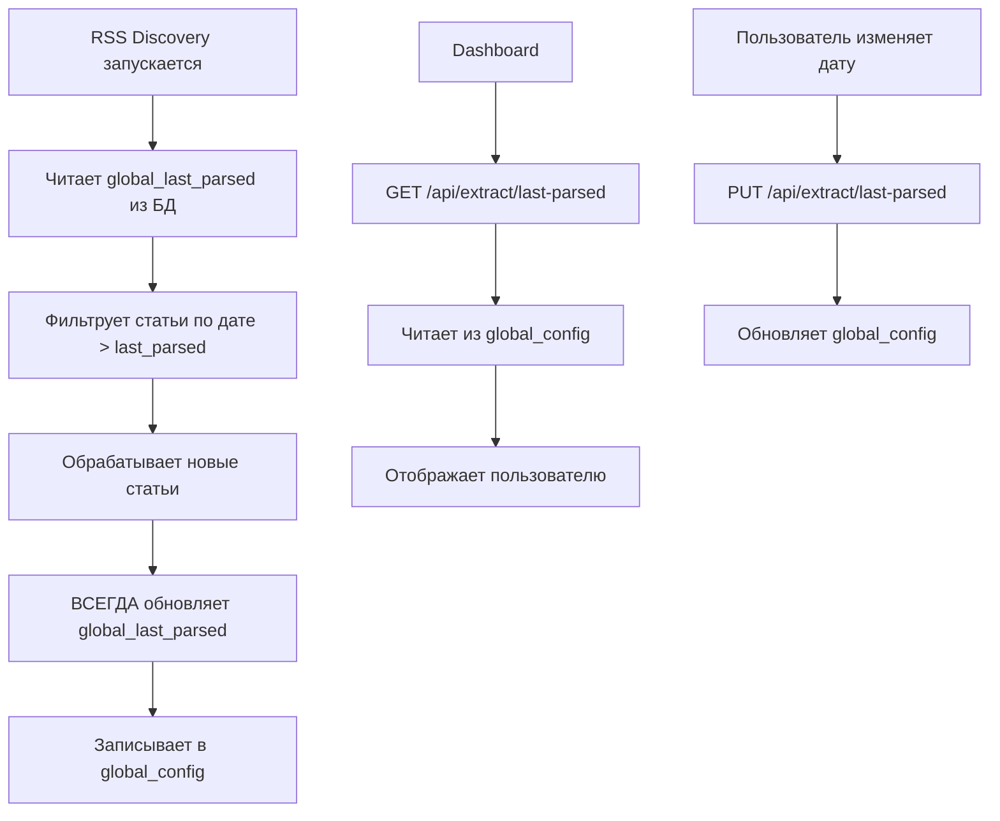

# Last Parsed System Documentation

## Обзор системы

`global_last_parsed` - это глобальная временная метка, которая отслеживает последний раз, когда система проверяла RSS источники. Это единственный источник правды для определения, какие статьи уже были обработаны.

## Архитектура

### 1. Хранение в БД

**Таблица**: `global_config`  
**Ключ**: `global_last_parsed`  
**Формат**: ISO 8601 с UTC timezone (например: `2025-08-08T14:01:09Z`)

```sql
-- Структура таблицы
CREATE TABLE global_config (
    key TEXT PRIMARY KEY,
    value TEXT,
    description TEXT,
    updated_at DATETIME DEFAULT CURRENT_TIMESTAMP
);

-- Пример записи
key: 'global_last_parsed'
value: '2025-08-08T14:01:09Z'
description: 'Global last parsed timestamp for all sources'
updated_at: '2025-08-08 17:01:09'
```

### 2. Компоненты системы

#### 2.1 RSS Discovery (`services/rss_discovery.py`)

**Чтение при старте:**
```python
# Получаем глобальный last_parsed timestamp
global_last_parsed = self.db.get_global_last_parsed()
last_parsed = datetime.fromisoformat(global_last_parsed.replace('Z', '+00:00'))
```

**Обновление после завершения (строки 375-382):**
```python
# Обновляем ВСЕГДА, независимо от количества новых статей
try:
    current_time = datetime.now(timezone.utc)
    timestamp_str = current_time.strftime('%Y-%m-%dT%H:%M:%SZ')
    self.db.set_global_last_parsed(timestamp_str)
    self.logger.info(f"Updated global last_parsed to: {timestamp_str}")
except Exception as e:
    self.logger.error(f"Error updating global last_parsed: {e}")
```

#### 2.2 Database Layer (`core/database.py`)

**Методы для работы с global_last_parsed:**

```python
def get_global_last_parsed(self) -> str:
    """Get global last parsed timestamp"""
    value = self.get_global_config('global_last_parsed')
    return value if value else '2025-08-01T00:00:00Z'

def set_global_last_parsed(self, timestamp: str):
    """Set global last parsed timestamp"""
    self.set_global_config('global_last_parsed', timestamp, 
                          'Global last parsed timestamp for all sources')
```

#### 2.3 API Endpoints (`monitoring/api_rss_endpoints.py`)

**GET /api/extract/last-parsed**
```python
# Возвращает global_last_parsed из global_config
cursor.execute("""
    SELECT value 
    FROM global_config 
    WHERE key = 'global_last_parsed'
""")
```

Ответ:
```json
{
    "last_parsed": "2025-08-08T14:01:09Z",
    "has_parsed": true,
    "source": "global_config"
}
```

**PUT /api/extract/last-parsed**
```python
# Обновляет global_last_parsed в global_config
cursor.execute("""
    INSERT OR REPLACE INTO global_config (key, value, description, updated_at) 
    VALUES (?, ?, ?, CURRENT_TIMESTAMP)
""", ('global_last_parsed', last_parsed, 'Global last parsed timestamp for all sources'))
```

#### 2.4 Dashboard (`monitoring/static/index.html`)

**Загрузка значения:**
```javascript
async function loadLastParsed() {
    const response = await fetch('/api/extract/last-parsed');
    if (response.ok) {
        const data = await response.json();
        if (data.last_parsed) {
            // Отображение в input поле datetime-local
            input.value = data.last_parsed.substring(0, 19);
        }
    }
}
```

**Сохранение изменений:**
```javascript
async function saveLastParsed() {
    const value = input.value;
    const response = await fetch('/api/extract/last-parsed', {
        method: 'PUT',
        headers: { 'Content-Type': 'application/json' },
        body: JSON.stringify({ last_parsed: isoString })
    });
}
```

## Поток данных



## Важные особенности

### 1. Обновление при каждом запуске
- `global_last_parsed` обновляется **ВСЕГДА** после RSS Discovery
- Не зависит от количества найденных статей
- Гарантирует, что система не будет повторно обрабатывать старые статьи

### 2. Единый источник правды
- Все компоненты используют значение из `global_config`
- Нет дублирования или рассинхронизации данных
- API всегда возвращает актуальное значение

### 3. Ручное управление
- Пользователь может изменить дату через дашборд
- Полезно для переобработки старых статей
- Изменения сразу применяются ко всем источникам

### 4. Формат времени
- Внутреннее хранение: ISO 8601 с UTC (`2025-08-08T14:01:09Z`)
- При сравнении: конвертируется в datetime с timezone awareness
- В дашборде: отображается в локальном времени пользователя

## Отладка и мониторинг

### Проверка текущего значения в БД:
```sql
SELECT key, value, datetime(updated_at, 'localtime') as local_time 
FROM global_config 
WHERE key = 'global_last_parsed';
```

### Проверка через API:
```bash
curl -s 'http://localhost:8001/api/extract/last-parsed' | jq '.'
```

### Логирование:
- При обновлении: `"Updated global last_parsed to: {timestamp}"`
- При ошибке: `"Error updating global last_parsed: {error}"`

### Проверка в operations.jsonl:
```bash
grep "rss_discovery_complete" logs/operations.jsonl | tail -1 | jq '.timestamp'
```

## Типичные проблемы и решения

### Проблема: Last parsed не обновляется
**Причина**: Старая версия кода с условием `if stats['new_articles'] > 0`  
**Решение**: Убрать условие, обновлять всегда

### Проблема: Дашборд показывает неправильное время
**Причина**: API возвращал MAX(parsed_at) из articles вместо global_last_parsed  
**Решение**: Изменить endpoint на чтение из global_config

### Проблема: RSS обрабатывает старые статьи повторно
**Причина**: global_last_parsed был сброшен или установлен слишком рано  
**Решение**: Проверить и исправить значение через дашборд или SQL

## История изменений

- **2025-08-08**: Убрано условие обновления только при новых статьях
- **2025-08-08**: API синхронизирован с global_config
- **2025-08-08**: Добавлена документация системы

---

*Последнее обновление: 8 августа 2025*